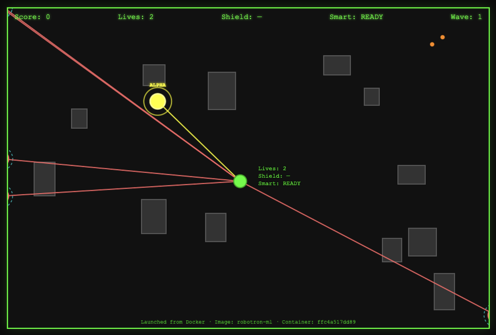
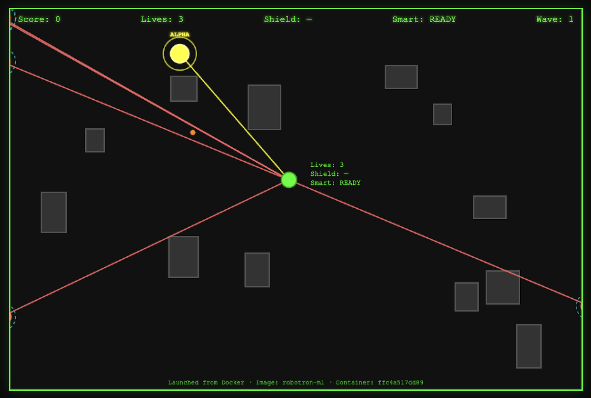
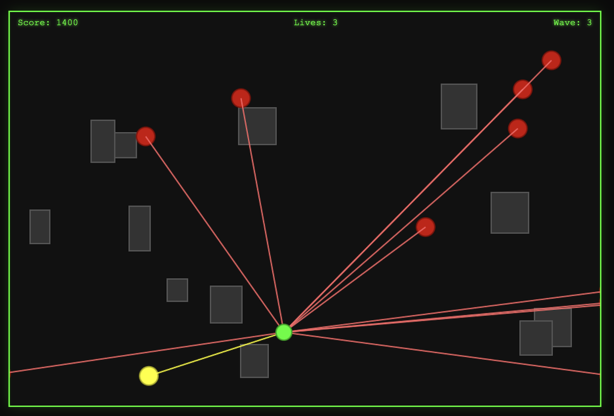

# Robotron with ML

Multidirectional shooter: move with **arrow keys**, shoot with **Space**. Fight hordes of robots that shoot back. Extra abilities: **S** Smart missile (homes on nearest robot), **F** Shield (hold), **G** New walls.

**Controls** (click the game area first so keys work): ↑↓←→ Move · Space Fire · S Smart missile · F Shield (hold) · G New walls · Enter/Click Start · P/Escape Pause.

**NeuroGamingLab** · Designer & architect: **Tuệ Hoàng**, AI/ML Engineer.  
*Multi-LLM–assisted development.*

### Screenshots

| Robotron 1 | Robotron 2 | Robotron 3 |
|------------|------------|------------|
|  |  |  |

---

## Python env + Streamlit (recommended)

**1. Create and use the virtual environment** (e.g. at `.venv`):

```bash
cd path/to/robotron-ml

# Activate venv
source .venv/bin/activate   # macOS/Linux
# or on Windows:  .venv\Scripts\activate

# Install deps (if not already done)
pip install -r requirements.txt
```

**2. Run the game with Streamlit:**

```bash
streamlit run app.py
```

Then open **http://localhost:8501** in your browser. Click the game area once so keys work.

---

## Docker

The image excludes `DONOT-MODIFY-template/`. Build and run:

```bash
docker build -t robotron-ml .
docker run -p 8501:8501 robotron-ml
```

Then open **http://localhost:8501**. The container runs Streamlit only; no template folder is included.

---

## Other ways to run

- **Shell script:** From project root, `./start.sh` (activates `.venv` and runs Streamlit; requires `chmod +x start.sh` if needed).
- **Open file:** Open `game/index.html` in a browser (double-click or File → Open). No policy injection (MARL/DNN) when run this way.
- **HTTP server:** From `game/`, run `python3 -m http.server 8080` and open http://localhost:8080.

## Project layout

- `app.py` — Streamlit app that embeds the game and injects optional MARL/DNN policy JSON
- `game/` — Game: `index.html` (self-contained), `css/`, `js/`; optional `marl_policy.json`, `dnn_predictor.json`
- `dnn/` — DNN player-position predictor (train & export to `game/dnn_predictor.json`)
- `marl/` — MARL (PPO) robot policy (train & export to `game/marl_policy.json`)
- `requirements.txt` — Python deps (Streamlit, numpy, torch)
- `DESIGN.md` — Game design doc
- `ML-README.md` — ML features doc
- `Dockerfile` / `.dockerignore` — Docker build (excludes `.venv`, template folder if present)
- `docs/` — GitHub Pages site (Neuro Gaming Lab theme). Enable in repo **Settings → Pages → Source: Deploy from branch → Branch: main, /docs**. Live at: **https://neurogaminglab.github.io/Neuro-Adaptive-Robotron-ML/**

---

**NeuroGamingLab** · Design & architecture: Tuệ Hoàng, AI/ML Engineer.  
*Multi-LLM–assisted development.*